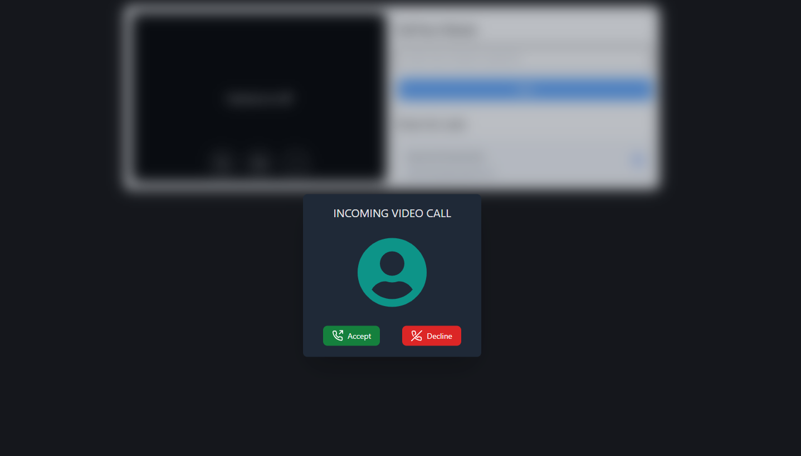

<h2 align="center">
Video Calling App</h2>

<p align="center"></p>

<p>Video calling web application, build with ReactJs, Tailwindcss, socket.io, webRTC and expressJs. That's allow user to call with your friends and messaging each other & share their screen with each other.</p>

## Tech Stack


&nbsp;&nbsp;
&nbsp;&nbsp;
&nbsp;&nbsp;
&nbsp;&nbsp;
&nbsp;&nbsp;

<h3>📝 Features</h3>

- <strong>Video call</strong>: Users can easily video call to friend.

- <strong>Mute & unmute:</strong> Mute own audio and aslo disable camera anytime.

- <strong>Share screen</strong>: User can easily share their full screen, specific window and much more customizations.

- <strong>Messaging</strong>: Users send and receive message in real time using webRTC channel.

## [`🚀 Live Demo`](https://video-call-app-rose.vercel.app/)

<h5>Homepage:</h5>


<h5>Incomming calling dialog:</h5>




<h5>Video call & messaging:</h5>


<h3>🛠️ Installation Steps:</h3>

<p>1. Clone the repository</p>

```
git clone https://github.com/harun-rucse/video-call-app.git
```

<p>2. Install the required dependencies in root directory </p>

```
npm install
```

<p>3. Install the required dependencies in client directory </p>

```
npm install
```

<p>4. Start the development server in root</p>

```
npm run dev
```

<p>4. Start the development server in client</p>

```
npm run dev
```

<p>4. Access the application at</p>

```
http://localhost:5173
```
